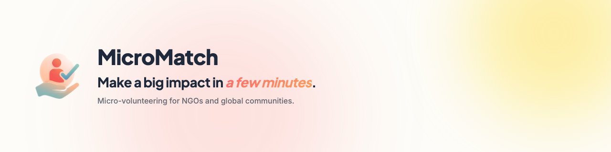
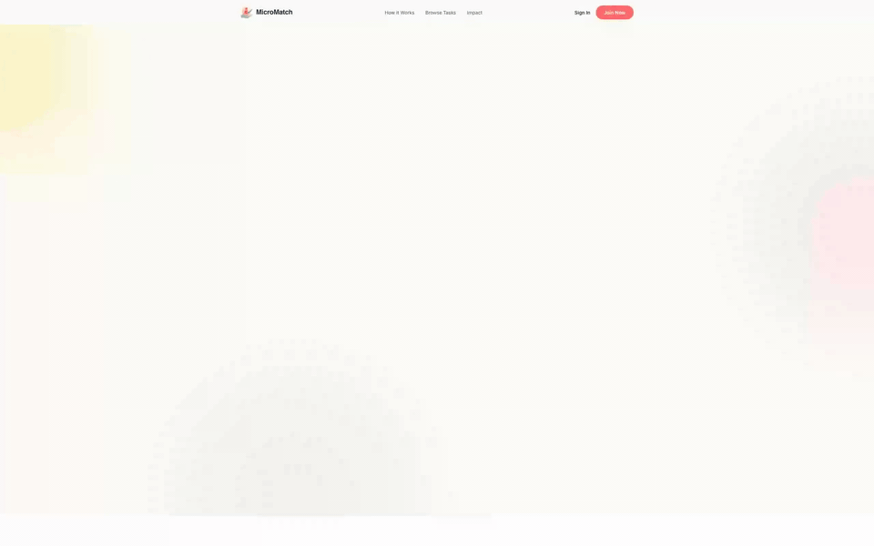
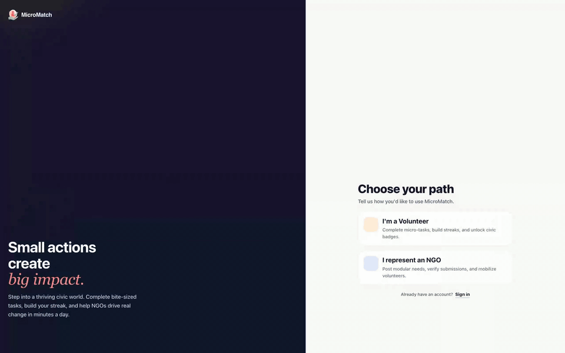
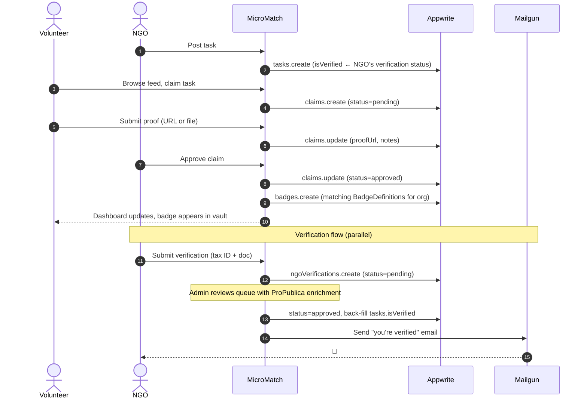

<div align="center">

<picture>
  <source media="(prefers-color-scheme: dark)" srcset="static/banner-dark.png">
  <source media="(prefers-color-scheme: light)" srcset="static/banner-light.png">
  
</picture>

<br />

[](https://opensource.org/licenses/MIT)
[](https://kit.svelte.dev/)
[](https://appwrite.io/)
[](https://bun.sh/)
[](#-testing)

</div>

<br />

> A micro-volunteering marketplace pairing NGOs with volunteers for bite-sized,
> skill-building tasks. Volunteers browse a feed of 5-30 minute missions, claim
> what fits their skills, and earn badges for approved work. NGOs post tasks,
> review submissions, and build a verified presence on the platform.

## ✨ Features

- **Bite-sized task feed** — filter by `≤15 / ≤20 / ≤30 min`, hashtag, or sort by shortest first.
- **Volunteer side** — claim tasks, submit proof (link or upload), track status, earn badges, level up.
- **NGO side** — post tasks with deadline + max-volunteers caps, review submissions, manage org-owned badge definitions.
- **NGO verification** — soft-gate trust system. NGOs submit a tax/charity ID, admins review with [ProPublica](https://projects.propublica.org/nonprofits/api/) lookup enrichment, approval back-fills the **Verified** chip on every existing task.
- **Custom badge definitions** — NGOs define their own awards (label, color, icon, criteria); the engine auto-awards on claim approval.
- **Role mobility** — users can flip between Volunteer and NGO; downgrading from NGO triggers a clean transactional teardown of verification + tasks.
- **Auto-translate** — task title + description translate to the viewer's language via Microsoft Azure Translator.
- **Email notifications** — verification approve/reject sends Mailgun-backed transactional emails to the NGO.

## 🎬 In motion

These are real Playwright recordings of the app — captured by the test suite at `e2e/demo/`, post-processed to GIF for embedding here. Nothing is mocked or sped up: every click is a real session against a real Appwrite backend.

<details>
  <summary><strong>The closed loop</strong> — claim → submit proof → NGO approves → badge lands</summary>

The whole product in one take. A volunteer claims a task and submits their work, the NGO reviews that submission and approves it, and the badge lands in the volunteer's vault. It all happens on-platform, without the handoff to email that a directory would leave you to. The sign-out in the middle is real: the volunteer and the org are two different accounts.


</details>

<details>
  <summary><strong>Landing page tour</strong> — hero → How it works → Featured tasks → Track your impact</summary>



</details>

<details>
  <summary><strong>Signup flow</strong> — role picker → fill the form (no real account is created)</summary>



</details>

<details>
  <summary><strong>Feed UX</strong> — search, time filters, and hashtag chips</summary>


</details>

<details>
  <summary><strong>NGO badge tooling</strong> — define a badge, then read the analytics</summary>

Badges are org-owned definitions rather than a hardcoded list: an NGO picks a template or builds its own, and the awarder mints it on claim approval.


</details>

<details>
  <summary><strong>Mobile nav</strong> — the hamburger menu at phone width</summary>


</details>

> Run `bun run demo` to regenerate: it reseeds, records fresh MP4s, and converts them to GIFs. The reseed is not optional. Demo tasks auto-archive after 30 days of no activity, and the closed-loop recording needs its claim and badge state reset or the badge never appears. See [CONTRIBUTING.md](CONTRIBUTING.md#recording-the-demos) for the one-time setup, `e2e/demo/` for the specs, and `playwright.demo.config.ts` for the recording configuration.

## 🔄 How it works

The core loop, end-to-end:



## 🚀 Tech stack

| | |
|---|---|
| **Framework** | [SvelteKit](https://kit.svelte.dev/) on [Vercel](https://vercel.com/) (`adapter-vercel`, `nodejs22.x` runtime) |
| **Runtime + package manager** | [Bun](https://bun.sh/) |
| **Backend** | [Appwrite Cloud](https://appwrite.io/) — Database (TablesDB), Auth, Storage, Teams |
| **Email** | [Mailgun](https://www.mailgun.com/) (HTTP API, no SDK dep) |
| **NGO verification** | [ProPublica Nonprofit Explorer API](https://projects.propublica.org/nonprofits/api/) for US 501(c)(3) lookups |
| **i18n** | [Azure Translator](https://azure.microsoft.com/en-us/services/cognitive-services/translator/) |
| **UI** | Plus Jakarta Sans + Inter, custom CSS (warm cream palette + coral accents), [Iconify](https://iconify.design/), [Lottie](https://lottiefiles.com/) |
| **Testing** | [Vitest](https://vitest.dev/) (unit + API + components) and [Playwright](https://playwright.dev/) (e2e) |

## 🏁 Getting started

Quick path:

```sh
git clone https://github.com/Builder106/MicroMatch.git
cd MicroMatch
bun install
cp .env.example .env
# Fill in Appwrite + Mailgun + ProPublica keys
bun run dev
```

The app runs at [http://localhost:5173](http://localhost:5173). Full setup (Appwrite resources, environment variables, project layout, conventions) lives in [CONTRIBUTING.md](CONTRIBUTING.md).

### Common scripts

```sh
bun run dev             # dev server with HMR
bun run build           # production build (uses adapter-vercel)
bun run check           # svelte-check + tsc
bun run test            # vitest (459 tests across server / API / components)
bun run test:e2e        # Playwright (run `bunx playwright install chromium` once)
bun run seed            # (re)seed the demo NGO + tasks — run before any demo recording
bun run demo            # seed, record the demo suite, convert to GIFs
bun run render-media    # regenerate the README banners + social preview from /static/*.html
```

## 🧪 Testing

Three layers of coverage:

- **Server modules** (vitest, node) — pure-ish helpers and DB CRUD: `tagColors`, `propublica`, `email`, `verifications`, `badgeDefs`, `badgeCriteria`, `badgeAwarder`. Mock fetch + Appwrite at the module boundary.
- **API endpoints** (vitest, node) — `/api/verifications`, `/api/verifications/[userId]/approve`, `/api/verifications/[userId]/reject`, `/api/profile/role`, `/api/badges/manage`. Auth gates, validation, multi-step side effects.
- **Components** (vitest, jsdom) — `BadgeChip`, `EmptyState`, `ProgressBar`, `VerificationCard` (all four state branches via mocked fetch).
- **End-to-end** (Playwright, chromium) — public-facing flows: landing, feed, login/signup multi-step, forgot-password, protected route redirect.

`bun run test:coverage` writes an HTML report to `coverage/`.

The demo suite in `e2e/demo/` is deliberately *not* part of this. It shares Playwright but exists to record the GIFs above, so it's slow by design (`slowMo`, dwell beats), needs seeded fixtures, and never runs in CI.

## 📦 Data model

Stored in Appwrite TablesDB:

| Table | Holds |
|---|---|
| `tasks` | Mission cards posted by NGOs (title, tags, time estimate, deadline, status, isVerified) |
| `claims` | Volunteer submissions for tasks (proofUrl, notes, status: pending / approved / rejected) |
| `badges` | Awarded badge instances (userId, taskId, label, color) |
| `badgeDefinitions` | Org-owned badge templates (orgId, label, criteria, taskId for task-specific) |
| `ngoVerifications` | Verification queue (orgName, country, taxId, docFileId, status, reason) |

Plus three Appwrite Teams (`volunteers`, `ngos`, `admins`) for role + moderation gating. Storage is one bucket with file-level permissions for both avatars and verification docs.

## 📝 Documentation

- [CONTRIBUTING.md](CONTRIBUTING.md) — local setup, project layout, conventions, PR process
- [docs/index.md](docs/index.md) — platform docs index
- [docs/volunteer.md](docs/volunteer.md) — volunteer guide
- [docs/ngo.md](docs/ngo.md) — NGO guide
- [docs/api.md](docs/api.md) — public API reference
- [docs/faq.md](docs/faq.md) — FAQ

## 📜 License

MIT — see [LICENSE](LICENSE).
